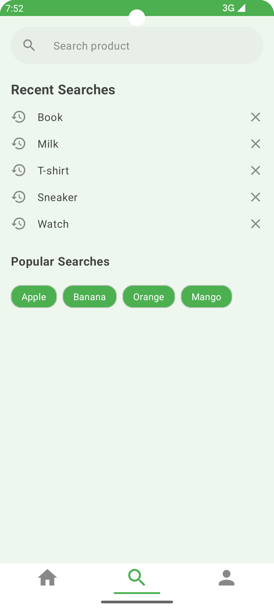

# ShopApp
This is a sample Android Shopping Application built using Jetpack Compose.

The app allows users to browse through a list of products, view product details, and manage their shopping cart.

## Architecture
This project implements the **MVVM (Model-View-ViewModel)** design pattern and follows **Clean Architecture** principles. This approach promotes a separation of concerns, making the codebase more modular, testable, and maintainable.

- **Domain Layer**: Contains the core business logic, use cases, and domain models.
- **Data Layer**: Handles data operations, providing data from sources like Firebase Firestore.
- **Presentation Layer (UI)**: Consists of Composable UI elements and ViewModels that prepare and manage data for the UI.

## Libraries and Features
- Jetpack Compose for the UI
- Firebase Firestore for product and category data
- Firebase Remote Config for dynamic content (promotion)
- Dagger - Hilt for dependency injection
- Jetpack Navigation for screen navigation
- MVVM and Clean Architecture for a robust and scalable app structure

## Screenshots

### Promotion & Home Screen
 

### Search Screen
 

### Detail Screen

### Cart Screen

